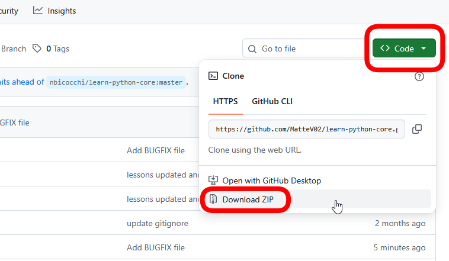
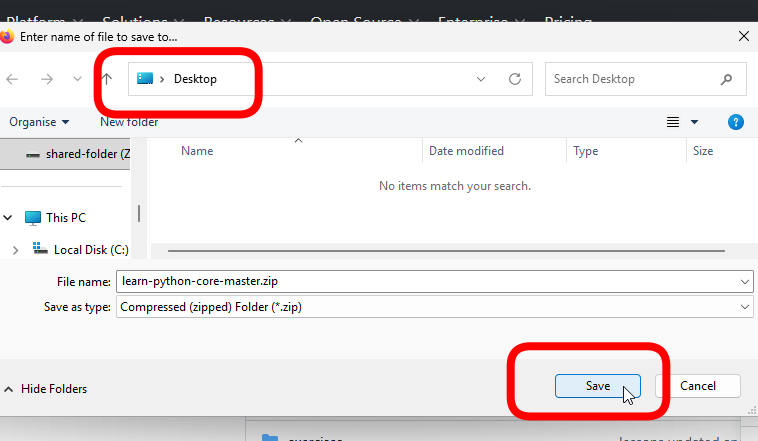
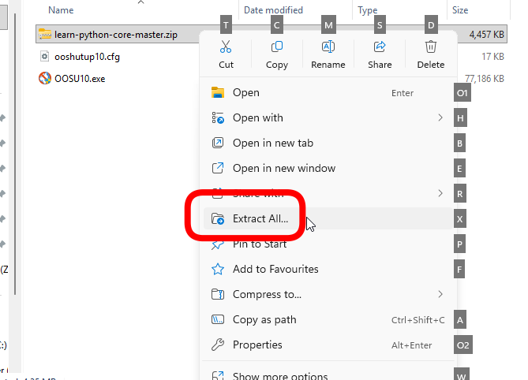
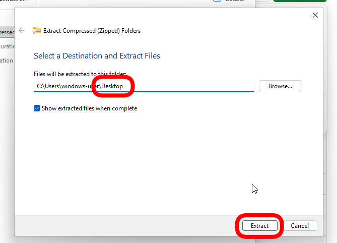
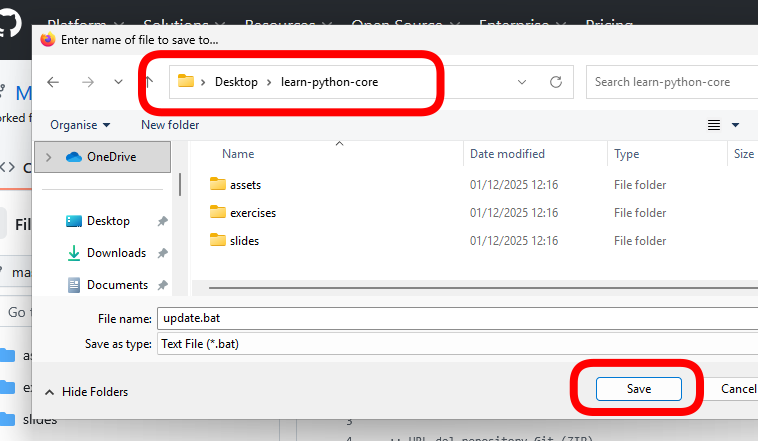

# BUGFIX

aka, come risolvere facilmente i problemi di Jupyter Notebook.  

1. **Errori / Eccessiva lentezza nell'esecuzione**
1. **Errori relativi a variabili che non avete dichiarato**
1. **Cartella chiusa?**
1. **Cartella mancante**
1. **Mancanza di slide/esercitazioni**

---

1. **Errori / Eccessiva lentezza nell'esecuzione** → Riavvio del kernel o riavvio di VSCode

1. **Errori relativi a variabili che non avete dichiarato** → Eseguire la cella con la dichiarazione della variabile

1. **Cartella chiusa?** → Riapri la cartella (si trova sul desktop)

1. **Cartella mancante** → Scarica la cartella
    - Vai su GitHub, scarica la cartella andando sul menu a tendina "Code" e poi su "Download ZIP" 
    - Scarica la cartella sul Desktop (se viene messa da altre parti, Ctrl+C e Ctrl+V per metterla nel luogo giusto) 
    - Facendo click col tasto sinistro sulla cartella ZIP scaricata, estraila 
    - Modifica il percorso di estrazione della cartella (**togli l'ultima parte**) ed estrai l'archivio ZIP 

1. **Mancanza di slide/esercitazioni** → Esegui lo script di aggiornamento
    - Vai sul GitHub del corso e apri lo script di aggiornamento:   
    - Scarica lo script: 
    - Posiziona lo script nella cartella del corso (è sul Desktop): 
        - NON tra i **Download**!
        - Ctrl+C, Ctrl+V per mettere il file nella cartella giusta
    - Esegui lo script: 
    - Se salta fuori questo avviso, eseguite comunque lo script: 