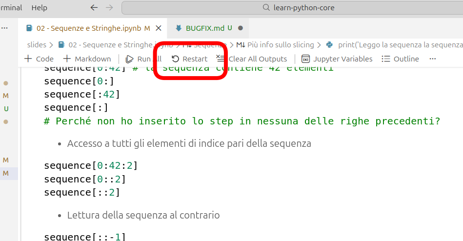
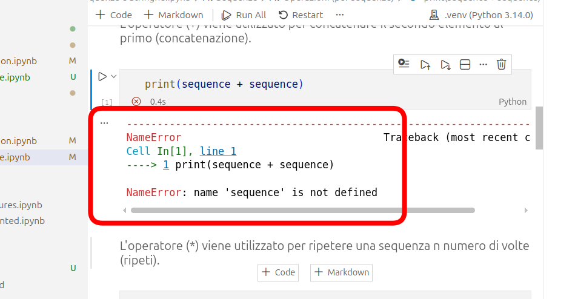
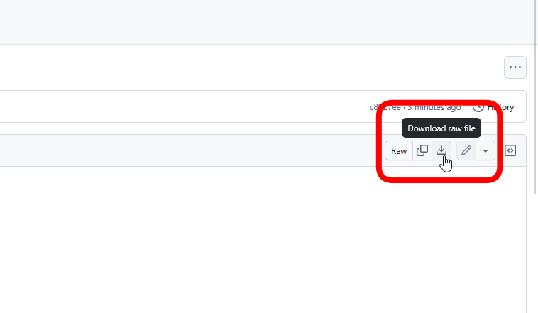
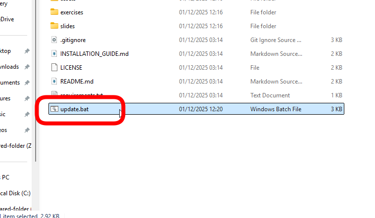
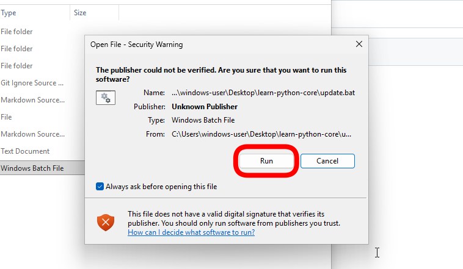
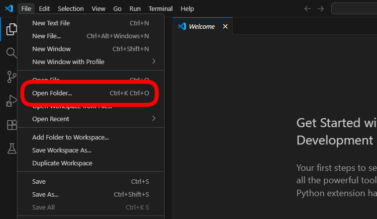

# BUGFIX

aka, come risolvere facilmente i problemi di Jupyter Notebook.  

1. **Errori / Eccessiva lentezza nell'esecuzione** → Riavvio del kernel o riavvio di VSCode

2. **Errori relativi a variabili che non avete dichiarato** → Eseguire la cella con la dichiarazione della variabile

3. **Mancanza di slide/esercitazioni** → Esegui lo script di aggiornamento
    - Vai sul GitHub del corso e apri lo script di aggiornamento:   
    - Scarica lo script: 
    - Posiziona lo script nella cartella del corso (è sul Desktop): ![bugfix-3c]
        > [!WARNING]
        > NON tra i **Download**!
        > Ctrl+C, Ctrl+V per mettere il file nella cartella giusta
    - Esegui lo script: 
    - Se salta fuori questo avviso, eseguite comunque lo script: 

4. **Cartella chiusa?** → Riapri la cartella (si trova sul desktop)
