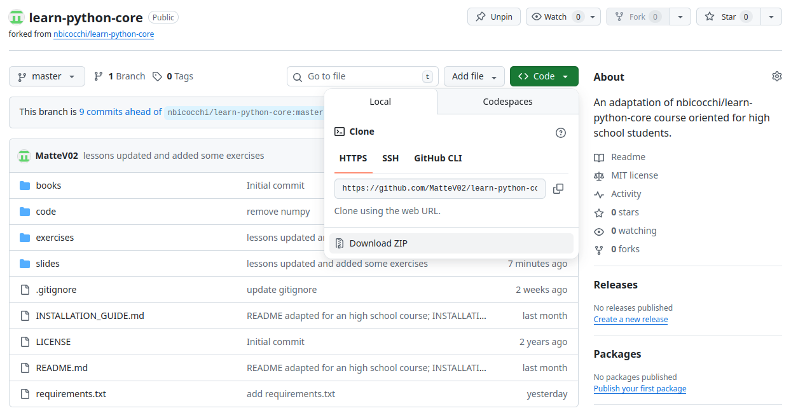

# Guida all'installazione

## Download cartella di lavoro
1. Digita nella barra di ricerca del browser `github.com/MatteV02`. 
2. Apri il link `learn-python-core`
3. Salva la pagina tra i preferiti
4. Scarica la cartella 

## Setup ambiente

1. Installazione Python
    1. Su sistemi Linux
        ```bash
        # In sistemi Debian-based
        sudo apt update && sudo apt install python
        ```
        ```bash
        # In sistemi RPM-based
        sudo dnf update && sudo dnf install python
        ```
    2. Su Windows/MacOS [[Download]](https://www.python.org/downloads/)

2. Installazione Visual Studio Code [[Download]](https://code.visualstudio.com/Download)

3. Installazione delle estensioni  
    1. Estensione Python [[Download]](https://marketplace.visualstudio.com/items?itemName=ms-python.python)
    2. Estensione Jupyter Notebook [[Download]](https://marketplace.visualstudio.com/items?itemName=ms-toolsai.jupyter)

    

4. Apri la cartella da dentro a VSCode
    